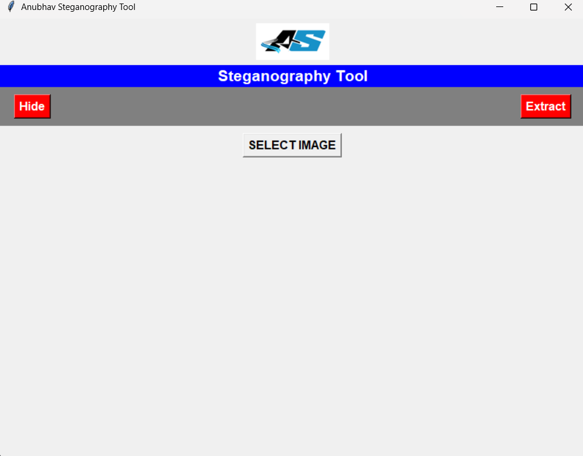

## Anubhav Steganography Tool


A powerful Steganography tool that allows users to hide and extract secret messages within images. Supports PNG, JPG, and JPEG formats with an intuitive GUI built using Tkinter.

## 🚀 Features

✅ Supports JPG, JPEG, and PNG images✅ Hide messages inside images securely✅ Extract hidden messages from images✅ Simple and user-friendly Tkinter GUI✅ Allows users to save images in different formats✅ Toggle message visibility in extraction mode✅ Fast and lightweight application

## 📸 Screenshots

🔹 Main Interface



🔹 Hiding a Message


🔹 Extracting a Message


## 📥 Installation

### 🔹 Requirements
Ensure you have **Python 3.8 or above** installed. Install the required dependencies:

```bash
pip install pillow tkinter easygui
```

### 🔹 Run the Application

```bash
python steganography_tool.py
```

---

## 🛠️ Usage Guide

1️⃣ **Select an Image** – Click the "Select Image" button and choose an image.  
2️⃣ **Hide a Message** – Enter the text you want to hide and press "Hide". Save the new image.  
3️⃣ **Extract a Message** – Load a steganographic image and click "Extract" to reveal the hidden message.  

---

## 🏗️ Technologies Used

- **Python** 🐍 – Core programming language
- **Pillow (PIL)** 🖼️ – Image processing library
- **Tkinter** 🎨 – GUI for user-friendly interaction
- **Steganography Encoding** 🔐 – LSB (Least Significant Bit) technique

---

## 📜 License

This project is **open-source** and available under the [MIT License](LICENSE).

---

## 👤 Author

👨‍💻 **Anubhav**  
🔗 [GitHub Profile](https://github.com/TONYSTARTOP)  
📧 anubhav09.work@gmail.com  

---

## ⭐ Contribute

Want to improve this project? **Fork, star, and submit a pull request!**  
If you like this project, don't forget to give it a ⭐ on GitHub! 🚀
```

